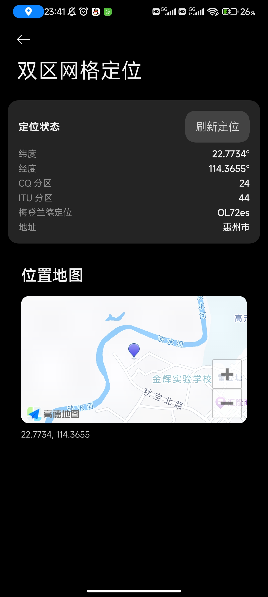
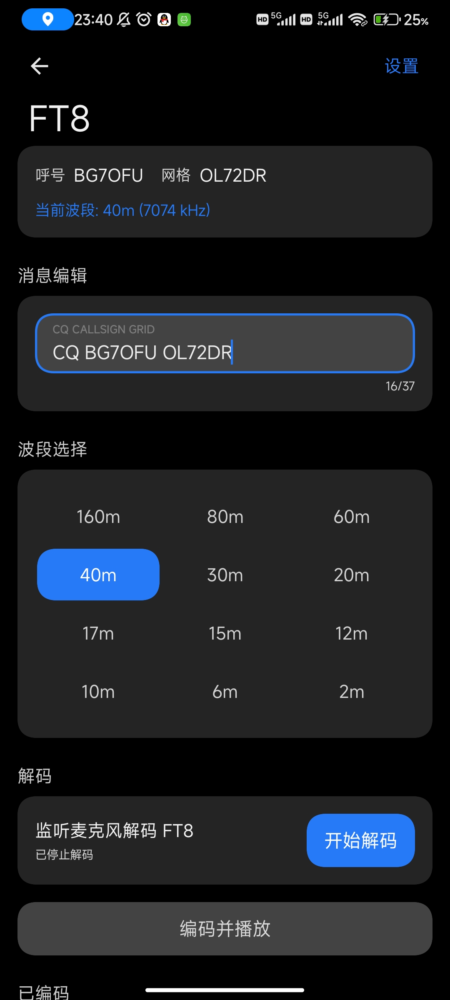
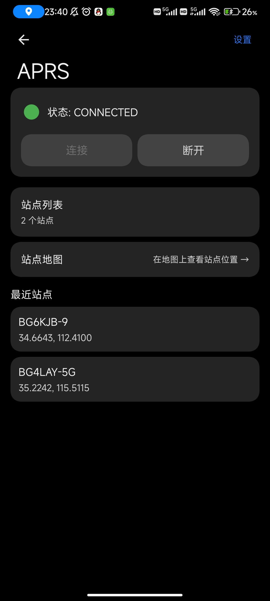
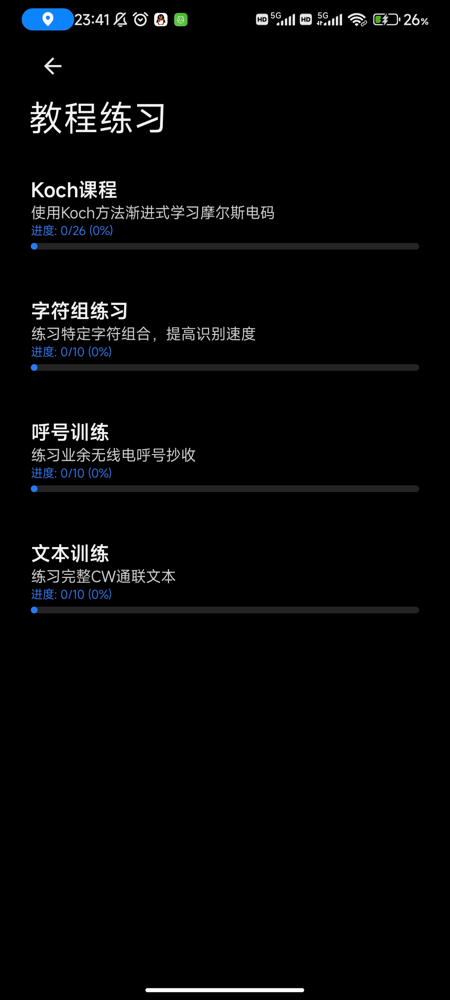

# HamKit

中文丨[English](README_EN.md)

为业余无线电爱好者打造的随身控制台——分区定位、卫星过境预测、CW 摩尔斯训练、过境提醒等功能一体化。

## 网站

[hamkit.click](https://hamkit.click)

## 开发路线图

### 已完成

- **CW 练习器**（摩斯电码学习）
- **卫星定位与追踪**（自研 SGP4/SDP4 引擎，Look4Sat 风格雷达图，SatNOGS 转发器频率库）
- **AMSAT 卫星状态**
- **日历过境提醒**
- **首页时间卡**（实时天气温度、UTC 时间、自定义背景图裁剪）

### 短期计划

- **FT8** 打磨（借鉴 [FT8CN](https://github.com/BG7HIM/FT8CN)）
- **APRS** 打磨（借鉴 [aprsdroid](https://github.com/ge0rg/aprsdroid)）

### 长期计划

- **RTTY** 开发（从零研究信号处理）

### 扩展规划

- QSO 日志记录
- QSO 导出（XML）
- 无线电中继查询（和相关授权方合作）

## 核心功能

### 分区定位
- 一键获取当前 GPS 坐标
- 实时计算 **CQ Zone**、**ITU Zone** 与 6 位 **Maidenhead 网格**定位
- 反向地理编码显示当前位置地址（3 秒去抖、失败指数退避自动恢复）

### 卫星过境预测
- 自研 **SGP4/SDP4** 轨道计算引擎（predict4java 仅用于差分验证），并行预测未来 48 小时过境
- 支持 **CelesTrak** TLE 数据源（amateur / satnogs 分组）
- 内置 **SatNOGS 转发器频率库**，提供收发器名称与频率信息
- **Look4Sat 风格雷达图**，极坐标实时显示在境卫星方位与俯仰
- 实时 **AMSAT** 状态查询（含延续标记），BJT 分段时间线，在境倒计时
- 收藏常用卫星，按收藏 → 在境 → AOS 排序

### CW 摩尔斯练习
- 完整 **Koch 课程**（26 课）+ 字符组 / 呼号 / 文本训练
- AudioTrack 实时合成正弦波，可调 WPM、音调与播放模式
- 训练进度跟踪

### 过境提醒
- AlarmManager 精确闹钟 + WorkManager 每日刷新
- AOS 前可配提前量提醒，支持仅白天模式
- 重启自动恢复（BootReceiver）

### 首页时间卡
- 集成实时天气温度与 UTC 时间
- 支持自定义背景图（内置 the_moon 月相图）与图片裁剪
- MaterialKolor 从背景图自动提取色板生成主题

## 应用截图

| 定位页面 | FT8 | APRS | CW 教程练习 |
| --- | --- | --- | --- |
|  |  |  |  |

## 技术栈

**语言与框架**
- Kotlin 2.4.0
- Jetpack Compose (BOM 2026.05.01)
- Material 3 Expressive (1.5.0-alpha22) + Miuix KMP 0.9.3
- Navigation3 1.1.2
- Coroutines 1.11.0

**数据与定位**
- Room 2.7.0 / DataStore 1.1.4
- Google Play Services Location 21.3.0
- OkHttp 5.3.2 / WorkManager 2.10.0

**领域专用**
- 自研 SGP4/SDP4 引擎（predict4java 1.3.1 仅用于差分验证）
- SatNOGS 转发器频率库
- 高德地图 3D SDK
- MPAndroidChart v3.1.0
- Coil Compose 2.7.0 / Palette 1.0.0
- MaterialKolor 4.1.1（动态取色）/ Commonmark 0.28.0（Markdown 渲染）

**工程化**
- Gradle 9.4.1 / AGP 9.2.1 / KSP 2.3.10
- JaCoCo 0.8.12 / R8 ProGuard
- GitHub Actions CI/CD

## 系统要求

- Android 8.0（API 26）及以上
- targetSdk 37
- 需定位权限

## 反馈

如有 bug 请在 [Issues](https://github.com/fuxue-linkong/HamKit/issues) 中提出，或发送邮件至 fuxuelingkong@outlook.com。

也欢迎提出功能需求（能力有限，不一定能实现）。

## 交流群

## 许可证

[MIT License](LICENSE)

## 声明

- 你看到的月亮不仅仅只是表相

本人不是 HAM，仅是对于业余无线电略为感兴趣，做这个只是周边人是业余无线电爱好者所提出想法，帮助实现而已，顺便学习学习开发过程（考证嘛.......估计高考后再考吧？我也不清楚到底会不会考，毕竟学生还得为学业为重😭😭😭依旧苦命学生族）
